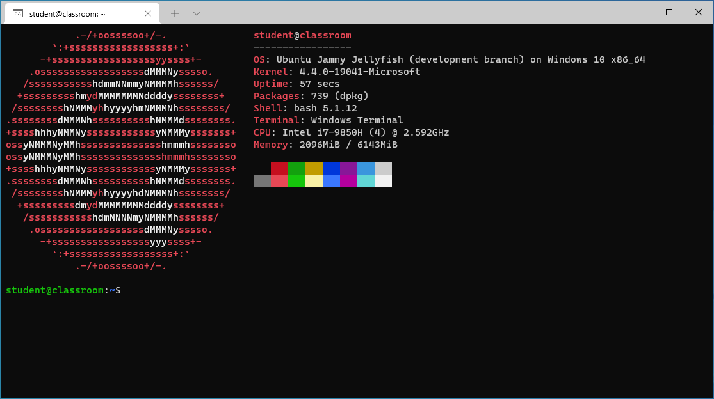

Windows
=======

Provisioning scripts and, files for Windows.

Classroom
---------

Provisions a ready-to-use Ubuntu WSL image for use in programming courses.

### Features

#### Windows

- 2-step idempotent installer (i.e. can be called more than once without any harmful effect)

- Supports multi languages (English and, Turkish at the moment)

- Enables full UTF-8

- Setups [WSL1](https://docs.microsoft.com/en-us/windows/wsl/) by default, adds support for [WSL2](https://docs.microsoft.com/en-us/windows/wsl/compare-versions)

- [Scoop](https://scoop.sh) for Windows package management

- Installs [Git](https://git-scm.com/)

- Installs [VS Code](https://code.visualstudio.com/) and, extensions for various programming languages

- Installs [Windows Terminal](https://www.microsoft.com/en-us/p/windows-terminal/9n0dx20hk701)

- Installs [Cascadia Font](https://github.com/microsoft/cascadia-code) for Windows Terminal

#### Linux

- Latest Ubuntu WSL image from [Ubuntu Cloud Images](https://cloud-images.ubuntu.com/)

- Standard tools: i.e. Git, Curl, SSH client, Tmux

- Programming languages: C, Python, Ruby, Javascript, Typescript

- Database: SQLite3 with LiteCLI

### FAQ

- **The process looks like a standard WSL installation. What if we followed the WSL installation instructions instead of
  using error-prone automation scripts for this?**

  The work done is not limited to a standard WSL installation, please review the feature set you will find in this
  document. Our goal is to make it easy for novice students (which we assume have predominantly Windows computers) to get
  started with programming in a healthy environment. And rest assured, the best way to do this isn't to offer a bunch
  of YouTube tutorials.

- **Why did you do this?  Isn't it better to install a native Linux OS?**

  I highly recommend installing a Linux distribution (e.g. Ubuntu, Debian).  But this can be difficult for novice
  students, especially when learning a new programming language.  Consider this as a pragmatic first step.

- **Is this work meant to encourage students to use Windows (perhaps with illegal copies)?**

  Nope.  On the contrary, I recommend that students switch to a native Linux environment as soon as they gain enough
  experience.  In addition, I advise them to use a licensed copy of Windows and avoid illegal installations.

- **Isn't Windows already enough for the purpose you mentioned?  What if they simply used Windows in their programming
  class?**

  Nope.  Windows may be a common and easy-to-use desktop environment, but as the primary development environment, I
  think it has a lot of problems (e.g. non POSIX, lack of a decent console environment, UTF-8 problems).

- **No Java, C# (Mono)?  Why?**

  Don't want to bloat the image.  You can always install them later via `apt-get` or, perhaps you may want to prefer
  native (IDE friendly) Windows runtimes.

- **How would you recommend using this environment?  Should students work entirely in a Linux console environment?**

  In the usual scenario, I foresee students to do all the editings in VS Code on the Windows side and, open a WSL
  console in VS Code to run the code.  They may also want to open WSL console from time to time outside of VS Code, in
  which case they can use the "Classroom Terminal" they will find on the desktop.

- **I am getting errors during installation. What should I do?**

  As a set of automation scripts, there may be many extreme conditions that we could not foresee. Please [create an
  issue](https://github.com/alaturka/windows/issues/new/choose).
